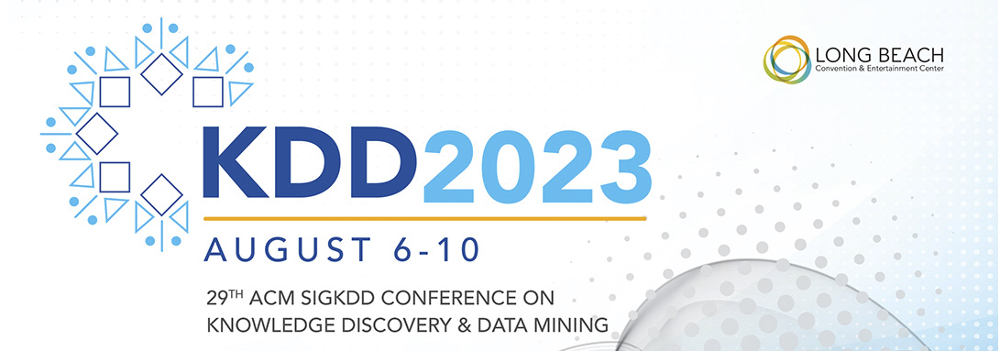
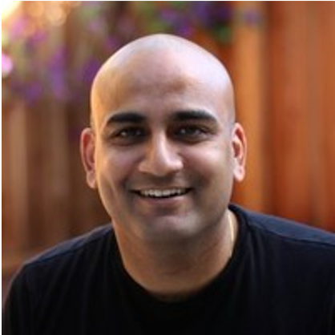

Welcome to KDD 2023 Entertainment, Sports and Media Day

KDD Special Days are satellite events co-hosted with the main conference with special emerging topics that are appealing to the KDD community. They are either half-day or one-day events with the forms of invited speakers, panel discussions, and demos, with the goal to discuss the trends, identify challenges, and provide visionary insights and solutions.

As KDD 2023 comes to the home of Hollywood, we are pleased to announce the special day on Entertainment, Sports and Media (ESM) Day. It will be a full day event where we will bring together leading researchers and practitioners from both academia and industry in the field of ESM. The topic of interests includes but not limited to:

* New technologies and applications of machine learning and data mining in entertainment, sports, and media
* Innovative approaches to engaging audiences and consumers such as conversational AI.
* New models for monetizing content and experiences
* Emerging trends and opportunities from big techs, start-ups and VCs in these industries
* Social and cultural impact of entertainment, sports, and media with the rise of streaming platforms and online services.

## Invited Keynote Speakers

|  |  |  |  |
| ---           | ---           |  ---   | ---   |
| Tracey Ho  |  Chris H. Wiggins | Adam Husein | Ritwik Kumar  |
| 	VP of AI Products, Second Spectrum |  Chief Data Scientist, New York Times |  SVP, Global Data Science & Analytics, Warner Bros | Senior Director, Machine Learning at Netflix |

|                |  |                |
| --- |  --- |--- |
| Mike Band                                                            | Zhutian (Zhu-Tian) Chen                                                               | Phil Martin                                                            |
| 	Senior Manager of Research and Analytics, Next Gen Stats at NFL    | Incoming Assistant Professor at University of Minnesota-Twin Cities                   | VP of Data Products and ML Strategy, FOX Corporation                   |

## KDD 2023 Entertainment, Sports and Media Day Program

Day: Aug 7 (Monday), 2023 | 8am - 5pm

Room: TBD

|     Time      |    Domain     | Title                                                                 | Speaker(s)                                                                     | 
|:-------------:|:-------------:|:----------------------------------------------------------------------|:-------------------------------------------------------------------------------| 
| 8:05 -  8:30  |    Kickoff    | Exciting opportunities for AI in Sports, Media and Entertainment      | Special Day Chairs                                                             |
| 8:30 -  9:10  | Entertainment | 	The Secrets of the Data Science Behind Hollywood's Magic             | [Adam Husein](https://www.linkedin.com/in/ahusein/)	                           | 
| 9:10 -  9:50  |    Sports     | 	Next way of seeing sports	                                           | [Tracey Ho](https://www.linkedin.com/in/traceych/)	                            |   
| 10:00 - 10:40 |    Media	     | Data science @ the New york Times	                                    | [Chris H. Wiggins](https://www.linkedin.com/in/wiggins/)	                      |   
| 10:40 - 11:20 | Entertainment | 	The Science & Art Of Producing Entertainment	                        | [Ritwik Kumar](https://www.linkedin.com/in/ritwik-kumar/)	                     | 
| 11:30 - 12:15 |     Panel     | AI Opportunities in Sports, Media and Entertainment                   | To be added                                                                    |
| 13:30 - 14:00 |    Sports     | To be added	                                                          | [Mike Band](https://www.linkedin.com/in/mike-band-analytics/)	                 |
| 14:00 - 14:30 |    Sports     | When Data Meets Reality Augmenting Sports Scenes with Visualizations	 | [Zhutian (Zhu-Tian) Chen](https://www.linkedin.com/in/zhutian-chen-69760484/)	 |
| 14:30 - 15:00 |    Sports     | To be added	                                                          | [Phil Martin](https://www.linkedin.com/in/philip-martin-7853ab7a/)	            |
| 15:00 - 16:00 |    Sports     | Selected Paper Presentations	                                         | To be added 	                                                                  |
| 16:00 - 16:45 |     Panel     | To be added	                                                          | To be added 	                                                                  |
| 16:45 - 17:30 |    Sports     | GenAI for Sports Workshop	                                            | [Henry Wang](https://www.linkedin.com/in/henry-yuanheng-wang-25206858/)	                                                                |

--- 
### Learn more about each keynote
> **The Secrets of the Data Science Behind Hollywood's Magic**

Learn about the Data Science that goes into making your favorite Movies and TV shows in "The Secrets of the Data Science Behind Hollywood's Magic." This talk offers a captivating dive into the intertwining worlds of data science and entertainment. Through personal experiences, innovative case studies, and invaluable insights, Adam unveils how data science, analytics, and AI shape the stories that enchant us. This talk will take you behind the scenes to show you groundbreaking analytics tools revolutionizing content creation, and provide a rare glimpse into the data-driven core of the entertainment industry. Attendees will walk away with practical knowledge and best practices that are as applicable in Hollywood as they are in any industry.

> **Next way of seeing sports**  

Artificial Intelligence, in particular Machine Learning and Computer Vision, are transforming sports.  In this talk, we give an inside look at new technologies and capabilities that sports teams, leagues, broadcasters and other partners are leveraging to fundamentally change many aspects of sports, from team analytics to personalized fan experiences, in places like the NBA, NFL and English Premier League.

> **Data science @ the New york Times**  

The Data Science group at The New York Times develops and deploys machine learning solutions to newsroom and business problems. Re-framing real-world questions as machine learning tasks requires not only adapting and extending models and algorithms to new or special cases but also sufficient breadth to know the right method for the right challenge. I'll first outline how unsupervised, supervised, and reinforcement learning methods are increasingly used in human applications for description, prediction, and prescription, espectively. I'll then focus on the 'prescriptive' cases, showing how methods from the reinforcement learning and causal inference literatures can be of direct impact in engineering, business, and decision-making more generally.

> **The Science & Art Of Producing Entertainment**  

Netflix plans to spend about $17 billion over the next year on content. Creators of these stories pour their hearts and souls into turning ideas into joy for Netflix viewers. The sublime art of doing this well is hard to describe, but it necessitates carefully orchestrating creative, business, and technical decisions. In this talk, I will explore how one can use data analytics, machine learning, and AI to enhance creativity and support better decisions that ultimately enable amazing storytelling.

> **When Data Meets Reality Augmenting Sports Scenes with Visualizations**
 
Zhutian will will introduce our latest research in using AR/VR visualization techniques to enhance the experience of sports analysts, audiences, and fans.

---

### Panel Discussion: AI Opportunities in Sports, Media and Entertainment
##### Time:  11:30 - 12:15
##### Panelist: 
* Adam Husein,	Warner Bros			SVP, Global Data Science & Analytics
* Karin Kricorian,	Disney			VP Decision Science, Disney
* Tracey Ho,	Second Spectrum		VP of AI Products at Second Spectrum

---
### Sponsorship
If you are interested in sponsoring this event or to be a speaker/panelist of this event, please contact: esm2023@kdd.org

---

### ESM Day Organizing Co-Chairs

| |  |   |
| ---           | ---           |  ---   |
| Shenghua Bao (Amazon) |  Weehyong Tok (Microsoft) | Haining Yu (Amazon) |

---
### Workshop on Data Science and AI for Sports (DSAI4Sports) Organizers
We are excited to announce that the ESM Day is joining force with [KDD 2023 Workshop on Data Science and AI for Sports (DSAI4Sports)](https://dsai4sports.github.io/). The DSAI4Sports workshop aims to bring together interested researchers and practitioners at the intersection of AI/ML and sports analytics. We will offer a platform to exchange research ideas, identify research opportunities and challenges in applying AI/ML for sports analytics, engage in thoughtful discussions, and foster the development of a research community centered around this field. Both the ESM Day and the DSAI4Sports workshop will take place on the same day (Aug 7th) and in same conference room.

|  |  |  |  |
|--------------------------------------|------------------------------------------|------------------------------------------------| ------------------------------------------------|
| Huan Song (Amazon)                   | Panpan Xu (Amazon)                       | Lin Lee Cheong (Amazon)                        | Henry Wang (Amazon)                     |
